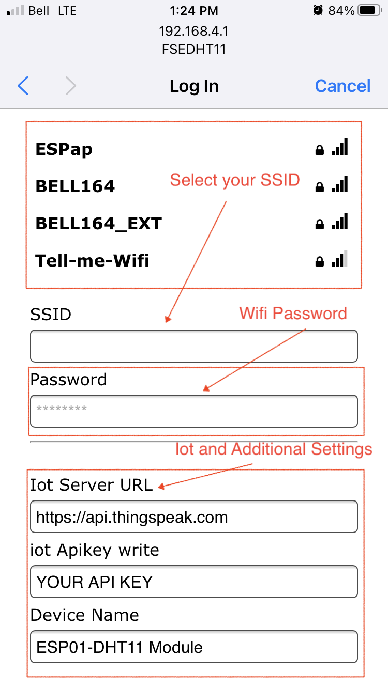

**FSECanada DTH11 Module**

***Introduction***

Firmware for FSECanada DHT11 module

***Iot Set up***
This firmware expects to access the Iot provider using a APIKEY. Please refer to your provider documentation for the steps required for that

***Techinical Details***
This firmware will GET request the your Iot API Url with the following data in the query String
* api_key = The apikey fro Writting data to your Iot provider
* field1 = The Temperature value read by the DHT11 module
* field2 = The Humidity value read by the DHT11 module
An Example request is as below:

```
curl --location --request GET 'https://api.thingspeak.com/update?api_key=YOUR_API_KEY&field1=25.58&field2=23&field3=device_name'
```

***Automatic WIFI Configuration***
When you first power the module after loading the firmware, a network will be created for Automatic configuration called FSEDHT11.


Selecting that network in your device will create a Webserver on http://192.168.4.1/. This webserver will be available for 2 Minutes and it will time out.

When using a iPhone device, a captive portal will open automatically. Otherwise, the configuration can be done using a Web Browser of your choice using the Webserver address http://192.168.4.1/.


When opening the URL, the first page will open with options for configuring your WIFI
Connection


After selecting *Configure WIFI* the next page will have the required fields for proper configuration.


